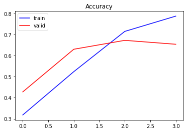
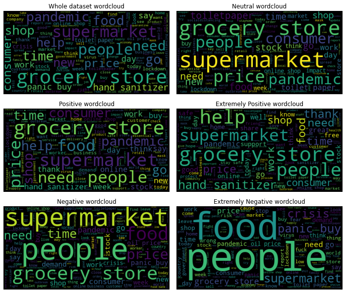
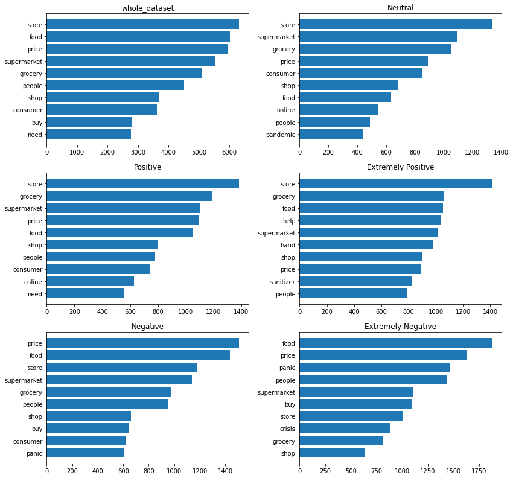
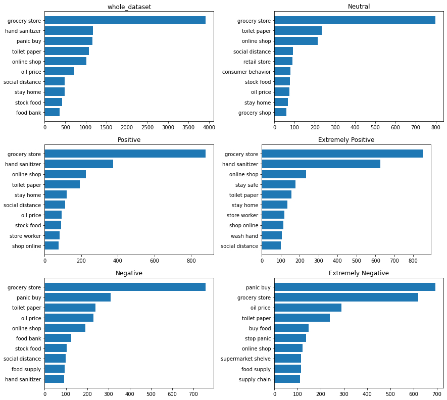

# Abstract {.unnumbered}

COVID-19 pandemic has drastically changed the daily lives and routine of people around the world. These changes have affected both the mental health and the emotions of the people who often post about how they feel in social media, such as Twitter. Their posts may express anger, sadness, frustration, optimism, or sometimes nothing at all. Thus, it is of interest to analyze and classify these posts based on the type of sentiment.

Several classification methods were used, which among others are Logistic Regression, Multinomial Naive Bayes, Linear Support Vector, Decision Tree, Random Forest, Extreme Gradient Boosting, Stochastic Gradient Descent and Recurrent Neural Network. The performance of the models was evaluated on their accuracy of predicting correctly the type of sentiment on unseen data. Most of the classifier models performed the same without much difference between them, however Decision Tree Classifier and Multinomial Naive Bayes performed the worst. The classifier that outperformed every other one is Recurrent Neural Network classifier, which achieved a really high accuracy compared to the rest of them.

\newpage

# Introduction

The COVID-19 pandemic is having a huge impact on people's lives in terms of not only physical but also mental health. During this pandemic, people changed their daily routine and habits drastically by staying at home, working from home,  going outside only to buy food from the supermarket and for physical exercise. People have mixed emotions and feelings about this new routine and they often publish their opinion on social media, such as Twitter. Their opinion includes a small text, limited to 280 characters, where they express how they feel about this pandemic and their new everyday life. Opinions can vary, that's why there is a need to classify them into separate categories. These categories are divided based on positive, negative and neutral opinions. Categorizing these opinions means that for each text, a tag/label is assigned to it, which specifies its category. This is a hard and time-consuming task to do for a human, thus it can be done by a computer using Natural Language Processing (NLP) and certain text classification algorithms.

The main goal of this project is to analyze some of the most important text classification algorithms and evaluate their performance on classifying correctly tweets related to COVID-19 Pandemic. For this task, the models are trained by getting as an input the tweet text and its label. Afterwards, each model tries to predict the label of unseen tweet texts based on the already trained model. Then, the predicted label is compared with the true/gold-standard label of the unseen tweets to calculate the accuracy of the predictor. Finally, the model that performs the best i.e. has the highest accuracy on predicting unseen data, is selected to be the optimal one for this particular task.

All code and report files for this project can be found in a GitHub repository [here](https://github.com/steliossid/covid19-classification).

# Theory

Several text classification algorithms were used for this project. All classification algorithms used in this project belong to supervised learning.

## Accuracy

The chosen measure of evaluating the performace of classifiers is the accuracy. In a binary classification problem, there are the predicted and the actual (true, gold-standard) labels of the unseen data (test set). A confusion matrix can be created with the True Positives, True Negatives, False Positives and False Negatives based on whether the guess of the label was right or wrong.

Accuracy is the total number of correct guesses (True Positives + True Negatives) divided by the total number of test examples.

$$Accuracy = \frac{TP+TN}{n_{test}}$$

## Multinomial Naive Bayes

Multinomial Naive Bayes computes the class probabilities for a given document $d$ and assigns the document $d$ to the class with the highest probability. Let $c\in C$, where $C$ is a list with all possible classes and $w\in V$, where $V$ is a list of all possible words.

The classifier computes: 

$$P(c|d)\propto P(c)P(d|c)$$

and the predicted class for the document is: 

$$\hat{c}=argmax_{c}P(c)\prod_{w}P(w|c)^{\#(w)}$$

where $argmax_{c}P(c)$ is the class c with the highest probability for document $d$, $P(w|c)$ is the probability that the document contains the word $w$ given that the document belongs to class $c$. [@4]

## Logistic Regression

In this project, the classes that are going to be predicted are more than two, so Multinomial Logistic Regression is needed. It is often called softmax regression, because it uses a generalization of the sigmoid function, the softmax function. In Multinomial Logistic Regression, a document $d$ is assigned to the class $c$, which is the one with the highest probability. These probabilities are computed via the softmax function:

$$P(y=c|x)=\frac{exp(w_cx+b_c)}{\sum_{j=1}^{C}exp(w_jx+b_j)}$$

where $x$ is the input vector and $w$, $b$ are the parameters. [@6]

## Decision Tree Classifier

A Decision Tree is a non-parametric supervised learning algorithm that consists of nodes, which are questions about the value of a variable, edges, which are the results of nodes and the leaf nodes which are the predicted classes. The predicted class is assigned after following a hierarchical structure of nodes and edges that lead to this specific class. [@10]

## Random Forest Classifier

Random Forest classifier belongs to ensemble learning and consists of multiple decision trees that operate as a whole, when training the model. Each decision tree in Random Forest predicts a class and then the final class is the one that gets the majority of the votes from all decision trees. This helps prevent overfitting that might happen in classic decision trees as a forest of decision trees protect each other from making errors, unless all trees are headed to the wrong direction. [@11] [@12]

## Linear Support Vector Classifier (SVC)

Trained on a a set of data, Linear Support Vector Classifier (SVC) tries to classify new data points to a category. Each training example $x_i$ is a $p$-dimensional vector. The goal of the SVC is to find the "maximum-margin hyperplane" that separates the training examples $x_i$ i.e. maximize the empty space between the categories in $p$-dimensional space. In this case, the hyperplane is:
$$w^Tx - b = 0 $$
where $w$ is the normal vector to the hyperplane. [@9]

## Stochastic Gradient Descent (SGD) Classifier

Stochastic Gradient Descent (SGD) Classifier is basically a linear classifier just like SVM and Logistic Regression, but with Stochastic Gradient Descent Training. Gradient Descent is an algorithm that minimizes functions in linear models (eg. Cost function). The algorithm starts from a random point of the function and then takes steps descending its slope to reach the lowest point i.e. the minimum of that function. Stochastic means that the samples are selected randomly or shuffled, instead of the order they appear in the training data. [@7] [@8]

## Extreme Gradient Boosting (XGB) Classifier

Boosting belongs to ensemble learning and the model consists of, typically, multiple decision trees. Adding new models to the existing one helps prevent the errors made by that model. Models are added, until no further improvements can be made. Gradient Boosting uses the gradient descent algorithm to minimize the loss function, when fitting new models to the existing one. [@13] [@14]

## Recurrent Neural Network (RNN)
Recurrent Neural Networks are neural networks that have the ability to process a series of input without any limit on size, such as series of letters or words. The main difference with classical neural networks is that one input of a series processed by an RNN has an influence on other inputs. Thus, an RNN has a memory that remembers things learnt from previous inputs, when making new predictions. An RNN can be trained using "backpropagation through time".

The RNN consists of several layers, which are important in order to make predictions. One important layer is the Embedding layer which takes as an input the number of distinct words in the data and outputs the mapping of these distinct words to a $d$-dimensional space. Embedding vectors are one-hot vectors, which mean that they consist of multiple zeros, except of a single one in their cells. This helps identify each unique word in the $d$-dimensional embedding space.

Another important layer in text classification is the LSTM (Long short-term memory) layer. When backpropagating to update the weights, there is a risk of vanishing (become too small) or exploding (become too large) gradients. LSTM solves this problem by making the short-term memory last as long as possible. LSTM has a specific structure, which consists of the cell, the input gate, the forget gate and the read gate. The cell saves the values $h_t$ at each sequence point and the gates work as masks to the input $x_t$ that produce $h_t$. [@15]

# Data

For this project, an already-made dataset from [Kaggle](https://www.kaggle.com/) was used. This dataset includes 44955 different tweets about COVID-19 and each tweet has a username, screenname, location, date, text and sentiment attributes. The five sentiment labels that each tweet is characterized by are Positive, Neutral, Negative, Extremely Positive and Extremely Negative. As stated in the dataset webpage, the username and screen name have been changed to a random sequence of numbers for privacy reasons. Moreover, all tweets where mined from [Twitter](https://twitter.com/) and the sentiment tag was assigned manually. [@1]

## Data Preprocessing

The dataset needs to be preprocessed before used by each model. Thus, several steps need to be followed, so that the data is in the correct form to be used from the models.

Since only the tweet text (`OriginalTweet`) and sentiment label (`Sentiment`) are needed, we discard `UserName`, `ScreenName`, `Location` and `TweetAt` attributes from the dataset. Next, no null values where found in this dataset, so there is no need to omit any rows.

Checking the balance of the dataset classes is one of the most important tasks to do, when preprocessing the data. Plotting the distribution of tweets over the five different sentiment categories, it is observed that the dataset is imbalanced. 

{width=40%}

A method that is widely used to tackle the issue of imbalanced datasets is random undersampling. This method randomly removes samples from the majority classes until all classes have the same number of samples. [@2]

## Natural Language Processing (NLP)

Processing the text of the tweet is another important task that needs to be done before training the models. For this project, [spaCy](https://spacy.io/), an open-source library for Natural Language Processing was used. [@3] spaCy along with other in-built functions were used to preprocess the tweet text. First, the text is tokenized i.e. split each tweet text into words and punctuation. Then all stopwords and non-alphabetic characters are ignored. Non-alphabetic characters and words include punctuation, numbers, links, hashtags and mentions, which are commonly used in tweets. Finally, all tokens are converted into lowercase format and those who have less than two characters are ingored.

# Method

After text preprocessing, the dataset columns needed are `ProcessedTweet` and `Sentiment`, which contain the processed tweet texts and their class respectively. The dataset is then split into training (80% of dataset) and test (20% of dataset) set. The evaluation of the different classification algorithms is done by comparing their test accuracy i.e. how accurate their predictions are on unseen data.

## Vectorizers

Two kinds of vectorizers were used in this project, which are the TF-IDF Vectorizer and Count Vectorizer. However, Count Vectorizer was only used in Multinomial Naive Bayes, because as stated in `MultinomialNB` documentation [@16], "the multinomial distribution normally requires integer feature counts". Both vectorizers use unigrams and bigrams, ignore terms that have document count lower than 3 and frequency higher than 0.9.

## Grid Search

Training models with the default hyperparameters for each model might not always produce optimal results. For this reason, tuning the hyperparameters helps the model perform the classification significantly better. In this case, Grid Search was used (`GridSearchCV` function in `sklearn` package), where it takes as an input the hyperparameters that need to be tuned, a range or discrete values for these hyperparameters and outputs the values with the best performance. Finally, the model is trained with these optimal values of the hyperparameters. 

In this report, most of the models found the best values for hyperparameters preety fast. However, Decision Tree Classifier and Extreme Gradient Boosting Classifier took longer than exepected when fine-tuning their hyperparameters, so default or custom values were used instead.

## Recurrent Neural Network (RNN)

Before building the RNN model, a transformation of each word in each preprocessed tweet text to an integer number needs to be happen. After the transformation, a preprocessed tweet text is represented as a vector of integer numbers (sequence), where each number correspond to a word in the tweet text. After that, it is required for all sequences to have the same length, which is the length of the longest sequence. This means that padding each sequence is needed, as well.

Feature encoding is also important before build the RNN model. This means that categorical class variable `Sentiment` needs to be converted into a numeric one, where 'Extremely Negative' corresponds to 0, 'Extremely Positive' to 1, 'Negative' to 2, 'Neutral' to 3 and 'Positive' to 4.

When building the model, a sequential model is used. The architecture of the model consists of an embedding layer, a bidirectional LSTM, a Global max pooling, a dropout, a dense ReLU, a dropout again and a dense softmax layer. When compilng the model, sparse categorical cross entropy is used as a loss function and Adam as optimizer.

The model is trained for 4 epochs with 64 batch size and 0.12 validation split.

# Results

Here are the results of the models presented in descending order according to their accuracy. The model that has the highest accuracy in its predictions is the Recurrent Neural Network (RNN) and the one that performed worst is the Decision Tree Classifier. 

| Model                                        | Accuracy |
|----------------------------------------------|----------|
| Recurrent Neural Network (RNN)               | 0.67     |
| Logistic Regression                          | 0.58     |
| Stochastic Gradient Descent (SGD) Classifier | 0.57     |
| Linear Support Vector Classifier (SVC)       | 0.56     |
| Random Forest Classifier                     | 0.54     |
| Extreme Gradient Boosting Classifier (XGB)   | 0.53     |
| Multinomial Naive Bayes                      | 0.49     |
| Decision Tree Classifier                     | 0.47     |

# Discussion

Recurrent Neural Network (RNN) model has the highest accuracy of all models and Decision Tree Classifier has the lowest one. Decision Tree having the lowest accuracy when comparing different classification models is also observed by Pranckevicius et al. in their report [@18]. The difference in their accuracies is 20%, which is a significant one.

Linear Support Vector outperformed Multinomial Naive Bayes, which is also observed by Kibriya et al. [@5] in their experiments. In addition, Logistic Regression performs better than Random Forest, which is also confirmed by Shah et al. [@17] in their experiments. However, the difference is only 2%, so it is not statistically significant. 

As for the RNN, after the 3rd epoch, the vaildation accuracy does not improve anymore, so the model starts overfitting. It can be clearly seen from the plot below, as it starts to decrease. Overfitting in RNN can be prevented by either using Early Stopping, a technique that stops training before overfit, or by training the RNN model for 3 epochs only.

{width=40%}

There is no actual distinction between the five classes, when comparing the words of tweet texts in each class. According to the wordclouds (Figure 3), the words "supermarket", "grocery store" and "people" appear in almost every class and they are of high frequency. This is also clearly shown, when looking at the uni-gram (Figure 4) and bi-gram (Figure 5) bar plots. According to the bi-gram plots, it is observed that "grocery store" is the most frequent bi-gram in all classes, except for "Extremely Negative" class, which is the second most frequent.

One possible limitation of this project could be the amount of data after balancing the five classes. Initially, there were 44955 records, but after balancing the classes there are 30327, which is a 32% decrease in data instances. Another possible limitation could be that the manual tagging of tweets in the dataset was not done correctly and some tweets were wrongly classified. Thus, if there was a re-evaluation of tagging the tweets, models could possibly achieve higher accuracies.

Overall, Logistic Regression, Stochastic Gradient Descent, Linear Support Vector, Random Forest and Extreme Gradient Boosting performed the same, as their accuracies are very close to each other, with the difference between the first and the last being only 5%.

# Conclusion

In this project report, different classification algorithms were presented, analyzed and their accuracy on the test set of COVID-19 tweets was evaluated. Accuracy was chosen to be the measure of comparison of different classification methods. Out of all of them, the one that has the highest accuracy on the test set is the RNN classifier. RNN outperformed any other model by far, as the difference in accuracy with the next one is 9%. The two models that did not perform so well are Multinomial Naive Bayes and Decision Tree classifiers.

\newpage

# Appendix {.unnumbered}

## Wordclouds {.unlisted .unnumbered}

\newpage

## Uni-grams {.unlisted .unnumbered}

\newpage

## Bi-grams {.unlisted .unnumbered}

\newpage

# References