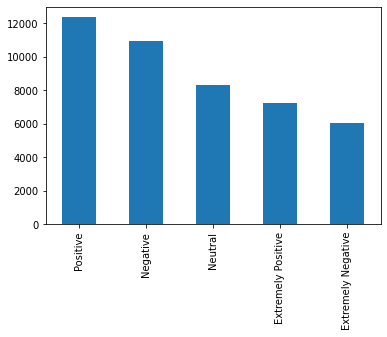

# Abstract {.unnumbered}

Lorem ipsum dolor sit amet, consectetur adipiscing elit. Duis auctor efficitur nisi ac ultricies. Nulla et viverra diam, ut interdum nibh. Vestibulum ante ipsum primis in faucibus orci luctus et ultrices posuere cubilia curae; Nulla facilisi. Aenean consequat aliquet elit eu semper. Fusce posuere quis purus sit amet pretium. Etiam ultrices finibus neque, quis laoreet justo sagittis in.

Etiam iaculis ultricies imperdiet. Cras purus nisl, vehicula nec ipsum hendrerit, tristique bibendum sem. Aenean sed urna euismod, volutpat augue aliquet, congue turpis. Mauris porttitor tempor volutpat. Aliquam ac dui lectus. Maecenas venenatis tempor nibh eu volutpat. Mauris quis posuere est. Nulla purus nisl, viverra facilisis ipsum id, feugiat lacinia lectus. Etiam sodales fermentum euismod. Nulla facilisi. Ut laoreet gravida nisi, at imperdiet magna vestibulum nec. Fusce rutrum ante magna, ut pulvinar sapien mollis posuere.

**Keywords:** text mining, opinion mining, sentiment analysis, classifing text

**GitHub repository:** https://github.com/steliossid/covid19-classification

\newpage

# Introduction

The COVID-19 pandemic is having a huge impact on people's lives in terms of not only physical but also mental health. During this pandemic, people changed their daily routine and habits drastically by staying at home, working from home,  going outside only to buy food from the supermarket and for physical exercise. People have mixed emotions and feelings about this new routine and they often publish their opinion on social media, such as Twitter. Their opinion includes a small text, limited to 280 characters, where they express how they feel about this pandemic and their new everyday life. Opinions can vary, that's why there is a need to classify them into separate categories. These categories are divided based on positive, negative and neutral opinions. Categorizing these opinions means that for each text, a tag/label is assigned to it, which specifies its category. This is a hard and time-consuming task to do for a human, thus it can be done by a computer using Natural Language Processing (NLP) and certain text classification algorithms.

The main aim for this project is to analyse some of the most important text classification algorithms and evaluate their performance on classifying correctly tweets related to COVID-19 Pandemic. For this task, the models are trained by getting as an input the tweet text and its label. Afterwards, each model tries to predict the label of unseen tweet texts based on the already trained model. Then, the predicted label is compared with the true/gold-standard label of the unseen tweets. Finally, the model that performs the best is selected to be the optimal one for this particular task.

# Theory

Several text classification algorithms were used for this project.

## Multinomial Naive Bayes

Multinomial Naive Bayes computes the class probabilities for a given document $d$ and assings the document $d$ to the class with the highest probability. Let $c\in C$, where $C$ is a list with all possible classes and $w\in V$, where $V$ is a list of all possible words.

The classifier computes: $P(c|d)\propto P(c)P(d|c)$

and the predicted class for the document is: $\hat{c}=argmax_{c}P(c)\prod_{w}P(w|c)^{\#(w)}$,

where $argmax_{c}P(c)$ is the class c with the highest probability for document $d$, $P(w|c)$ is the probability that the document contains the word $w$ given that the document belongs to class $c$. [@4]

## Logistic Regression

In this case, the classes that are going to be predicted are more than two, so Multinomial Logistic Regression is needed. It is often called softmax regression, because it uses a generalization of the sigmoid function, the softmax function. In Multinomial Logistic Regression, a document $d$ is assigned to the class $c$ with the highest probability. These probabilities are computed via the softmax function:

$$P(y=c|x)=\frac{exp(w_cx+b_c)}{\sum_{j=1}^{C}exp(w_jx+b_j)}$$

where $x$ is the input vector and $w$, $b$ are the parameters. [@6]

## Random Forest Classifier

Phasellus ac consequat nibh, vel condimentum quam. Morbi in est ut odio pharetra feugiat a quis nulla. Donec rhoncus eget nunc vitae ullamcorper. Sed quis bibendum ex. Nullam non augue nec leo facilisis facilisis ullamcorper non turpis. Nullam rhoncus, ipsum non efficitur viverra, velit ligula hendrerit felis, porta feugiat eros urna ac justo. Vestibulum ante ipsum primis in faucibus orci luctus et ultrices posuere cubilia curae; Nam gravida consectetur rhoncus. Vivamus suscipit ut nulla non vestibulum. Phasellus maximus nisl non odio porta, vel volutpat ligula volutpat.

## Decision Tree Classifier

Phasellus ac consequat nibh, vel condimentum quam. Morbi in est ut odio pharetra feugiat a quis nulla. Donec rhoncus eget nunc vitae ullamcorper. Sed quis bibendum ex. Nullam non augue nec leo facilisis facilisis ullamcorper non turpis. Nullam rhoncus, ipsum non efficitur viverra, velit ligula hendrerit felis, porta feugiat eros urna ac justo. Vestibulum ante ipsum primis in faucibus orci luctus et ultrices posuere cubilia curae; Nam gravida consectetur rhoncus. Vivamus suscipit ut nulla non vestibulum. Phasellus maximus nisl non odio porta, vel volutpat ligula volutpat.

## Linear Support Vector Classifier (SVC)

Phasellus ac consequat nibh, vel condimentum quam. Morbi in est ut odio pharetra feugiat a quis nulla. Donec rhoncus eget nunc vitae ullamcorper. Sed quis bibendum ex. Nullam non augue nec leo facilisis facilisis ullamcorper non turpis. Nullam rhoncus, ipsum non efficitur viverra, velit ligula hendrerit felis, porta feugiat eros urna ac justo. Vestibulum ante ipsum primis in faucibus orci luctus et ultrices posuere cubilia curae; Nam gravida consectetur rhoncus. Vivamus suscipit ut nulla non vestibulum. Phasellus maximus nisl non odio porta, vel volutpat ligula volutpat.

## Stochastic Gradient Descent (SGD) Classifier

Phasellus ac consequat nibh, vel condimentum quam. Morbi in est ut odio pharetra feugiat a quis nulla. Donec rhoncus eget nunc vitae ullamcorper. Sed quis bibendum ex. Nullam non augue nec leo facilisis facilisis ullamcorper non turpis. Nullam rhoncus, ipsum non efficitur viverra, velit ligula hendrerit felis, porta feugiat eros urna ac justo. Vestibulum ante ipsum primis in faucibus orci luctus et ultrices posuere cubilia curae; Nam gravida consectetur rhoncus. Vivamus suscipit ut nulla non vestibulum. Phasellus maximus nisl non odio porta, vel volutpat ligula volutpat.

## Extreme Gradient Boosting (XGB) Classifier

Phasellus ac consequat nibh, vel condimentum quam. Morbi in est ut odio pharetra feugiat a quis nulla. Donec rhoncus eget nunc vitae ullamcorper. Sed quis bibendum ex. Nullam non augue nec leo facilisis facilisis ullamcorper non turpis. Nullam rhoncus, ipsum non efficitur viverra, velit ligula hendrerit felis, porta feugiat eros urna ac justo. Vestibulum ante ipsum primis in faucibus orci luctus et ultrices posuere cubilia curae; Nam gravida consectetur rhoncus. Vivamus suscipit ut nulla non vestibulum. Phasellus maximus nisl non odio porta, vel volutpat ligula volutpat.

## Recurrent Neural Network (RNN)
Phasellus ac consequat nibh, vel condimentum quam. Morbi in est ut odio pharetra feugiat a quis nulla. Donec rhoncus eget nunc vitae ullamcorper. Sed quis bibendum ex. Nullam non augue nec leo facilisis facilisis ullamcorper non turpis. Nullam rhoncus, ipsum non efficitur viverra, velit ligula hendrerit felis, porta feugiat eros urna ac justo. Vestibulum ante ipsum primis in faucibus orci luctus et ultrices posuere cubilia curae; Nam gravida consectetur rhoncus. Vivamus suscipit ut nulla non vestibulum. Phasellus maximus nisl non odio porta, vel volutpat ligula volutpat.

# Data

For this project, an already-made dataset from [Kaggle](https://www.kaggle.com/) has been used. This dataset includes 44955 different tweets about COVID-19 and each tweet has username, screenname, location, date, text and sentiment attributes. The five sentiment labels that each tweet is characterized by are Positive, Neutral, Negative, Extremely Positive and Extremely Negative. As stated in the dataset webpage, the username and screen name have been changed to a random sequence of numbers for privacy reasons. Moreover, all tweets where mined from [Twitter](https://twitter.com/) and the sentiment tag was assigned manually. [@1]

## Data Preprocessing

The dataset needs to be preprocessed before used by each model. Thus, several steps need to be followed, so that the data is in the correct form for the models.

Since only the tweet text (`OriginalTweet`) and sentiment label (`Sentiment`) are needed, we discard `UserName`, `ScreenName`, `Location` and `TweetAt` attributes from the dataset. Next, no null values where found in this dataset, so there is no need to omit any rows.

Checking if the dataset is balanced or not is one of the most important tasks to do, when preprocessing the data. Plotting the distribution of tweets over the five different sentiment categories, it is observed that the dataset is imbalanced. 

{width=50%}

A method that is widely used to tackle the issue of imbalanced datasets is random undersampling. This method randomly removes samples from the majority classes until all classes have the same number of samples. [@2]

## Natural Language Processing (NLP)

Processing the text of the tweet is another important task that needs to be done before training the models. For this project, [spaCy](https://spacy.io/), an open-source library for Natural Language Processing was used. [@3] spaCy along with other in-built functions were used to preprocess the tweet text. First, the text is tokenized i.e. split each tweet text into words and punctuation. Then all stopwords and non-alphabetic characters are ignored. Non-alphabetic characters and words include punctuation, numbers, links, hashtags and mentions, which are really common in tweets. Finally, all tokens are converted into lowercase format and tokens that have less than two characters are ingored.

\newpage

## Statistics

### Wordclouds

\newpage

### Uni-grams

\newpage

### Bi-grams

\newpage

# Method

*Explain how you carried out your study. Aim to be detailed enough for others to reproduce your results.*

Mauris vestibulum venenatis turpis eu blandit. Sed est tellus, auctor id tortor a, pellentesque consequat quam. Phasellus efficitur elit et rutrum egestas. Phasellus sagittis leo non sollicitudin tincidunt. Vivamus rhoncus iaculis aliquam. Proin pretium, risus ut tempor consectetur, nunc augue pretium est, at cursus velit justo vel arcu. Proin dictum ligula a commodo rutrum.

# Results

*Present your results in an objective way. Use tables and charts, but do not forget to also include a summary in text form. Do not interpret your results.*

Images here.

\newpage

# Discussion

*Analyse your results and discuss the possibilities and limitations of your technical approach. Compare your study to related work.*

Phasellus ac consequat nibh, vel condimentum quam. Morbi in est ut odio pharetra feugiat a quis nulla. Donec rhoncus eget nunc vitae ullamcorper. Sed quis bibendum ex. Nullam non augue nec leo facilisis facilisis ullamcorper non turpis. Nullam rhoncus, ipsum non efficitur viverra, velit ligula hendrerit felis, porta feugiat eros urna ac justo. Vestibulum ante ipsum primis in faucibus orci luctus et ultrices posuere cubilia curae; Nam gravida consectetur rhoncus. Vivamus suscipit ut nulla non vestibulum. Phasellus maximus nisl non odio porta, vel volutpat ligula volutpat.

\newpage

# Conclusion

*Based on your results and their analysis, what new knowledge do you take away from your project?*

Phasellus ac consequat nibh, vel condimentum quam. Morbi in est ut odio pharetra feugiat a quis nulla. Donec rhoncus eget nunc vitae ullamcorper. Sed quis bibendum ex. Nullam non augue nec leo facilisis facilisis ullamcorper non turpis. Nullam rhoncus, ipsum non efficitur viverra, velit ligula hendrerit felis, porta feugiat eros urna ac justo. Vestibulum ante ipsum primis in faucibus orci luctus et ultrices posuere cubilia curae; Nam gravida consectetur rhoncus. Vivamus suscipit ut nulla non vestibulum. Phasellus maximus nisl non odio porta, vel volutpat ligula volutpat.

\newpage

# References